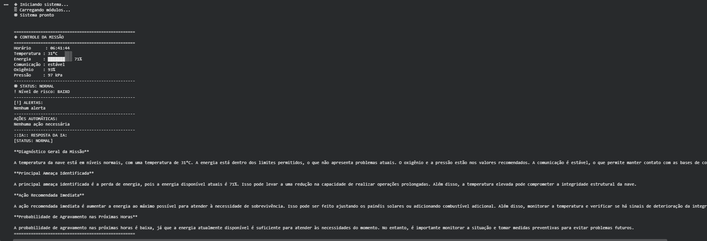
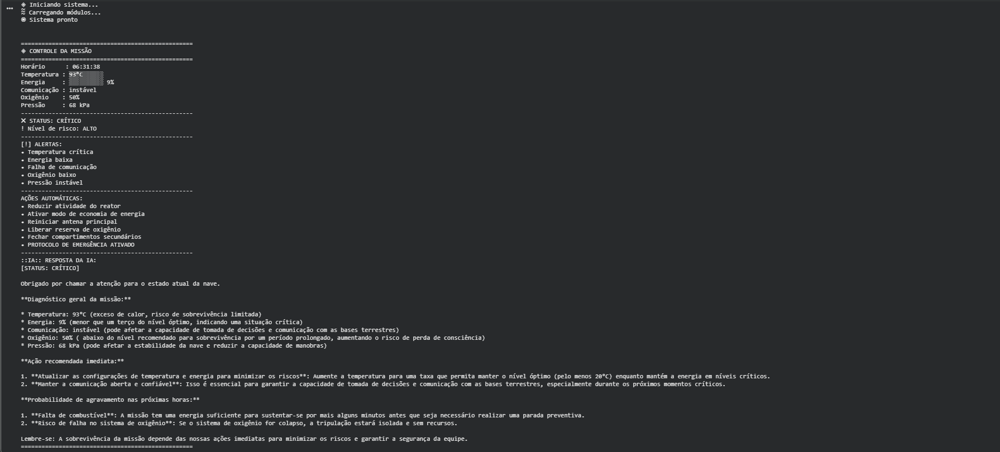

# GLOBAL-SOLUTION-2026.1
Sistema de monitoramento de missão espacial com IA local utilizando Python, Ollama e Llama 3.2.

# Mission Control AI — USG ISHIMURA Operational System

**Integrantes:**

- Aneliza Rondina Bonafé — RM: 572977
- Rafaella Ferreira de Moraes — RM: 571030

---
# Sobre o Projeto

Sistema de monitoramento de missão espacial desenvolvido em Python utilizando inteligência artificial local com Ollama e o modelo Llama 3.2.

O sistema simula sensores críticos da nave, como temperatura, energia, comunicação, oxigênio e pressão, gerando alertas automáticos, respostas operacionais e ações de emergência em situações críticas.

A IA é responsável por interpretar os dados recebidos e produzir relatórios técnicos objetivos com base no estado atual da missão.
# Demonstração

## Sistema operando normalmente

## Situação crítica com resposta da IA

---

# Como Executar

O projeto foi desenvolvido para execução no Google Colab.

---

## Abrir Notebook

[Acessar Notebook](https://colab.research.google.com/drive/1SRH5e2RcGKYOU6JfZDsxq-EjSQfXZwQV?usp=sharing)

---

## Execução

Execute as células em ordem.

O notebook irá:

- instalar o Ollama
- baixar automaticamente o modelo Llama 3.2
- iniciar o sistema de IA
- gerar os cenários da missão
- exibir os relatórios operacionais

---

## Vídeo

Vídeo explicativo e demonstrativo do sistema Mission Control AI.

[Link do Vídeo](https://youtu.be/W84CUZX2jlg)
